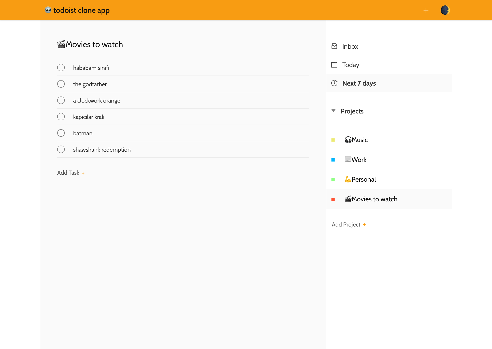
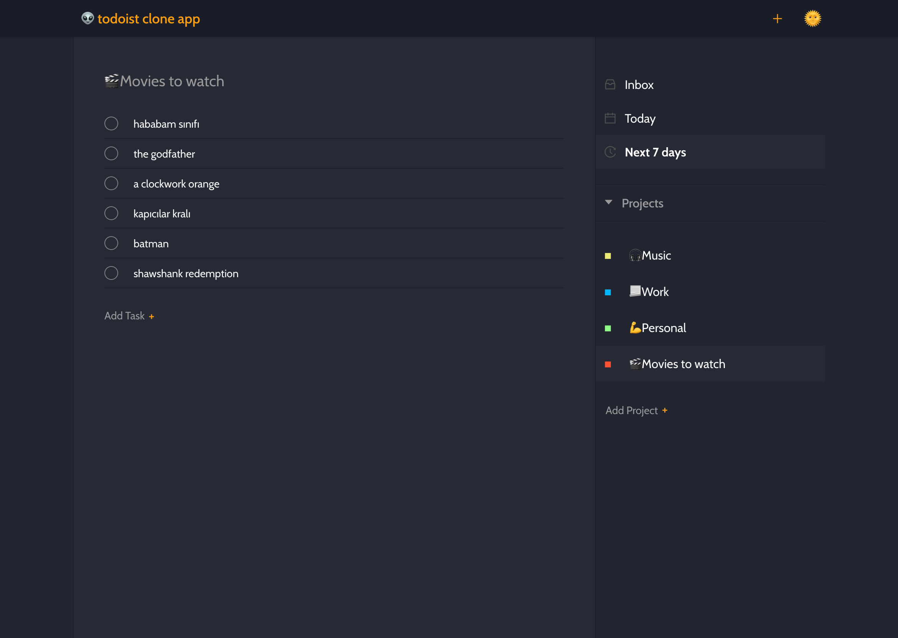

# Todoist Clone App

This is a [Todoist App](https://todoist.com/) Clone (not completely) React application . I just prepared this to practice for React Hooks.

#### Installation

- You need [Firebase](https://firebase.google.com/) Firestore database.
- After creating a database, you can change the filename `firebaseConfig.sample.js` to `firebaseConfig.js` and initilize the firebase settings into it.
- Run the command `yarn` in project directory to install dependencies.

#### Starting the app

In the project directory, you can run: `yarn start` to run the app in the development mode. 
Open [http://localhost:3000](http://localhost:3000) to view it in the browser.

---

##### Dark

##### Light

